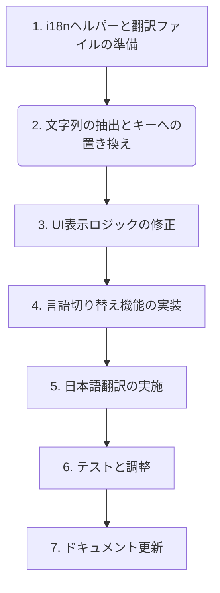

# 多言語対応（国際化・地域化）計画

## 1. 方針

*   **国際化 (i18n) ライブラリの導入:** 翻訳文字列の管理と切り替えを容易にするため、自作のシンプルな翻訳ヘルパー関数とJSONファイルで対応します。
*   **翻訳ファイルの管理:** 言語ごとに翻訳文字列を記述したファイル（例: `locales/en.json`, `locales/ja.json`）を作成し、管理します。
*   **文字列の抽象化:** UIに表示される文字列を直接ハードコードするのではなく、翻訳キーを介して参照するように変更します。
*   **言語設定:** Obsidian本体の言語設定を検出し、それに合わせてプラグインの表示言語を自動的に切り替えることを目指します。フォールバックとして英語を指定します。

## 2. 影響範囲

*   **コマンド名、リボン名など:** `src/main.ts` で定義・登録される文字列。
*   **設定画面の項目名、説明文:** `src/settings.ts` で定義されるUI要素の文字列。
*   **通知メッセージ:** `new Notice()` で表示される動的なメッセージ。
*   **モーダルダイアログ内のテキスト:** `src/modals/AmazonLoginModal.ts` や `src/modals/AmazonLogoutModal.ts` 内のユーザー向けテキスト。

## 3. 具体的な計画ステップ



1.  **i18nヘルパーと翻訳ファイルの準備:**
    *   `src/i18n.ts` に翻訳ヘルパー関数 (`loadTranslations`, `t`) を作成します。
    *   `src/locales/` ディレクトリを作成し、`en.json` (英語のデフォルト文字列) と `ja.json` (日本語訳用) を配置します。
    *   キーの命名規則: 階層的で分かりやすい命名規則を定めます (例: `settings.outputDirectory.name`, `commands.sync.name`)。

2.  **文字列の抽出とキーへの置き換え:**
    *   対象ファイル (`src/main.ts`, `src/settings.ts`, `src/modals/*.ts`) 内のハードコードされたUI文字列を特定し、`t('key')` や `t('keyWithVar', { varName: value })` の形式に置き換えます。
    *   対応するキーと英語文字列を `en.json` に定義します。

3.  **UI表示ロジックの修正:**
    *   プラグイン起動時 (`onload` 内) に `loadTranslations()` を呼び出し、ユーザーの言語設定に基づいて翻訳をロードします。
    *   `SettingsTab` やモーダル内で、翻訳関数 `t()` を使って動的にテキストを設定するようにします。

4.  **言語切り替え機能の実装:**
    *   `loadTranslations()` 内で Obsidian の現在の言語設定 (`moment.locale()`) を検出し、適切な翻訳ファイルをロードします。
    *   対応言語がない場合は英語にフォールバックします。

5.  **日本語翻訳の実施:**
    *   `ja.json` ファイルに、`en.json` で定義されたすべてのキーに対応する日本語訳を記述します。

6.  **テストと調整:**
    *   英語環境と日本語環境の両方で、すべてのUI文字列が正しく表示・切り替えられることを確認します。
    *   変数を含む文字列の補間が正しく機能することを確認します。
    *   レイアウト崩れなどが発生しないか確認します。

7.  **ドキュメント更新:**
    *   多言語対応した旨をREADMEなどに記載します。

## 4. i18nヘルパーの基本構造 (src/i18n.ts)

```typescript
// src/i18n.ts (新規作成)
import { moment } from "obsidian";

interface Translations {
	[key: string]: string | Translations;
}

let translations: Translations = {};
let currentLocale = "en";

const locales: Record<string, () => Promise<Translations>> = {
	en: async () => (await import("./locales/en.json")).default,
	ja: async () => (await import("./locales/ja.json")).default,
};

export async function loadTranslations(locale?: string): Promise<void> {
	const targetLocale = locale || moment.locale();
	currentLocale = locales[targetLocale] ? targetLocale : "en";

	try {
		translations = await locales[currentLocale]();
		console.log(`Kindle Highlights: Loaded translations for ${currentLocale}`);
	} catch (e) {
		console.error(`Kindle Highlights: Failed to load translations for ${currentLocale}, falling back to en.`, e);
		currentLocale = "en";
		translations = await locales.en();
	}
}

function resolveKey(key: string, obj: Translations): string | undefined {
	return key.split('.').reduce((acc, part) => {
		if (typeof acc === 'object' && acc !== null && part in acc) {
			return acc[part] as string | Translations;
		}
		return undefined;
	}, obj) as string | undefined;
}

export function t(key: string, params?: Record<string, string | number>): string {
	let translation = resolveKey(key, translations);

	if (typeof translation !== 'string') {
		console.warn(`Kindle Highlights: Translation not found for key "${key}" in locale "${currentLocale}". Returning key.`);
		translation = key;
	}

	if (params) {
		for (const paramKey in params) {
			translation = translation.replace(new RegExp(`{{${paramKey}}}`, "g"), String(params[paramKey]));
		}
	}
	return translation;
}
```

## 5. 翻訳対象文字列の例

### `src/main.ts`
*   コマンド名: `Sync Kindle Highlights`, `Logout from Kindle`
*   リボンツールチップ: `Sync Kindle Highlights`
*   通知: `Starting Kindle highlights sync...`, `Amazon session not found. Please log in.`, etc.
*   ノート内文字列: `位置:`, `Note:` (テンプレートで管理する方が望ましいが現状main.tsにあるもの)

### `src/settings.ts`
*   設定項目名: `Output Directory`, `Note Template`, `Amazon Region`, `Download Metadata`
*   説明文: `Directory where highlights will be saved`, `Select your Amazon Kindle region`, etc.
*   ボタン: `Reset to Default`
*   テーブルヘッダー: `Variable`, `Description`
*   変数説明: `Book title`, `Book author`, etc.
*   リージョン名: `USA (.com)`, `Japan (.co.jp)`

### `src/modals/AmazonLoginModal.ts`
*   ウィンドウタイトル: `Amazon (${this.region}) Login - Kindle Highlights Sync`
*   通知: `Error: Cannot initiate login...`, `Amazon login successful!`

### `src/modals/AmazonLogoutModal.ts`
*   モーダルタイトル: `Amazon Logout Confirmation`
*   本文: `Are you sure you want to log out...`, `Note: This attempts to clear the session...`
*   ボタン: `Logout`, `Cancel`
*   通知: `Logging out...`, `Logout failed: ${error.message}`
