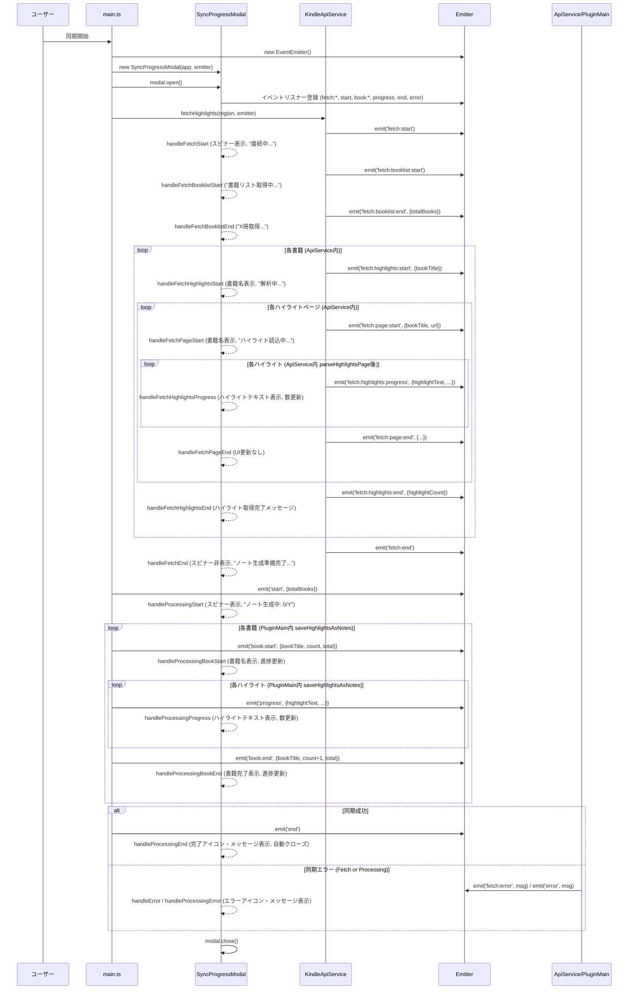

# Kindleハイライト同期プログレスモーダルの設計 (更新: 2025-04-07)

## 1. 概要

このドキュメントは、Kindleハイライト同期プロセス中にObsidian内に表示されるプログレスインジケータモーダルの設計を概説します。目的は、進行中の同期操作に関する明確な視覚的フィードバックをユーザーに提供することです。

## 2. 要件

*   **UI要素:** Obsidianの `Modal` を使用する。
*   **視覚的フィードバック:** **スピナー**を表示する。
*   **情報表示:**
    *   **データ取得フェーズ:**
        *   Amazonへの接続中。
        *   書籍リストの取得中。
        *   ハイライト取得中の書籍名。
        *   取得中のハイライトテキスト（長い場合は一行に切り詰め）。
        *   現在の書籍で取得済みのハイライト数。
    *   **ノート生成フェーズ:**
        *   処理中の書籍名。
        *   処理中のハイライトテキスト（長い場合は一行に切り詰め）。
        *   現在の書籍で処理済みのハイライト数。
        *   全体的な書籍処理の進捗（例: `ノート生成中: X / Y`）。
    *   完了時またはエラー時に適切なメッセージとアイコンを表示する。
*   **イベント駆動:** UI更新は `EventEmitter` を介して行い、バックグラウンド処理とUIを分離する。

## 3. UIデザイン

専用のObsidian `Modal` サブクラス (`SyncProgressModal`) が作成されます。

**モーダル構造（実装反映）:**

```
+-------------------------------------------+
| Kindle同期                              |  <- モーダルタイトル (動的に変化: 取得中/生成中/完了/エラー)
+-------------------------------------------+
|                                           |
|  [ スピナー (表示/非表示) ]               |  <- スピナー要素 (`.loading-spinner`)
|                                           |
|  [ ステータスメッセージコンテナ ]         |  <- テキスト要素のコンテナ (`.kindle-sync-status-container`)
|    - 一般メッセージ (例: 初期化中...)     |  <- `.messageEl` (動的に表示/非表示)
|    - 書籍: [現在の書籍タイトル]            |  <- `.currentBookEl` (動的に表示/非表示)
|    - 進捗: [現在のフェーズの進捗]          |  <- `.bookProgressEl` (動的に表示/非表示, 例: ノート生成中: X/Y)
|    - ハイライト: [現在のハイライトテキスト...] |  <- `.currentHighlightEl` (動的に表示/非表示, 省略あり)
|    - ハイライト数: [現在の書籍のハイライト数] |  <- `.highlightProgressEl` (動的に表示/非表示)
|                                           |
|  [ 完了/エラーアイコン (表示/非表示) ]     |  <- アイコン用Div (`.modal-success-icon` / `.modal-error-icon`)
|                                           |
+-------------------------------------------+
```

**スタイリングに関する注意点:**

*   **スピナー:** Obsidian標準の `.loading-spinner` クラスを利用し、マージン調整用のカスタムクラス (`.kindle-sync-spinner`) を追加する。
*   **レイアウト:** テキスト要素は中央揃えで表示する (`.kindle-sync-status-container` クラスで制御)。
*   **ハイライトテキスト:** 省略記号付きの一行表示のためにCSSを適用する (`.kindle-sync-current-highlight` クラス)。フォントサイズを小さくし、色を `var(--text-muted)` に設定する。
*   **アイコン:** 完了時・エラー時に表示するアイコンのサイズ (48px) と色をCSSで定義する (`.modal-success-icon svg`, `.modal-error-icon svg`)。
*   **表示切替:** `.u-display-none` ユーティリティクラスを使用して、各テキスト要素の表示/非表示を動的に制御する。

## 4. データフローと更新メカニズム

Node.jsの `EventEmitter` を使用したイベントベースのシステムにより、UIと同期ロジック (`KindleApiService`, `main.ts`) が分離されます。

**イベント:**

*   **データ取得フェーズ (`KindleApiService` が発行):**
    *   `fetch:start`: データ取得開始。
    *   `fetch:booklist:start`: 書籍リスト取得開始。
    *   `fetch:booklist:end` (ペイロード: `{ totalBooks: number }`): 書籍リスト取得完了。
    *   `fetch:page:start` (ペイロード: `{ bookTitle: string, url: string }`): 特定書籍のハイライトページ読み込み開始。
    *   `fetch:highlights:start` (ペイロード: `{ bookTitle: string }`): 特定書籍のハイライト解析開始。
    *   `fetch:highlights:progress` (ペイロード: `{ bookTitle: string, highlightText: string, highlightsParsedOnPage: number, totalHighlightsForBook: number }`): 個々のハイライト解析進捗。
    *   `fetch:highlights:end` (ペイロード: `{ bookTitle: string, highlightCount: number }`): 特定書籍のハイライト解析完了。
    *   `fetch:page:end` (ペイロード: `{ bookTitle: string, url: string, highlightsFound: number }`): 特定書籍のハイライトページ処理完了。
    *   `fetch:end`: 全てのデータ取得完了。
    *   `fetch:error` (ペイロード: `errorMessage: string`): データ取得中の汎用エラー。
    *   `fetch:book:error` (ペイロード: `{ bookTitle: string, error: string }`): 特定書籍のハイライト取得エラー。
    *   `fetch:page:error` (ペイロード: `{ bookTitle: string, url: string, error: string }`): 特定ページの読み込み/解析エラー。
*   **ノート生成フェーズ (`main.ts` が発行):**
    *   `start` (ペイロード: `{ totalBookCount: number }`): ノート生成処理開始。
    *   `book:start` (ペイロード: `{ bookTitle: string, booksProcessedCount: number, totalBookCount: number }`): 特定書籍のノート生成開始。
    *   `progress` (ペイロード: `{ bookTitle: string, booksProcessedCount: number, totalBookCount: number, highlightsProcessedCountForBook: number, currentHighlightText: string }`): 個々のハイライト処理進捗。
    *   `book:end` (ペイロード: `{ bookTitle: string, booksProcessedCount: number, totalBookCount: number }`): 特定書籍のノート生成完了。
    *   `end` (ペイロード: なし): 全てのノート生成完了。
    *   `error` (ペイロード: `errorMessage: string`): ノート生成中のエラー。

**シーケンス図 (実装反映):**



## 5. 実装概要

1.  **`src/modals/SyncProgressModal.ts` の作成/修正:**
    *   `obsidian.Modal` を拡張する。
    *   コンストラクタは `App` と `EventEmitter` を受け入れる。
    *   `onOpen()`: スピナーとテキスト表示用のDOM構造を構築し、CSSを適用し、emitterイベントを購読する。
    *   `onClose()`: emitterイベントの購読を解除する。
    *   スピナー表示/非表示 (`showSpinner`, `hideSpinner`) とテキスト要素の更新/表示切替 (`updateStatus`) のためのヘルパーメソッドを実装する。
    *   データ取得フェーズ (`handleFetch*`) とノート生成フェーズ (`handleProcessing*`) のためのイベントハンドラを実装する。
    *   完了時 (`handleProcessingEnd`) とエラー時 (`handleError`) の表示ロジックを実装する (アイコン使用)。
2.  **同期トリガーとの統合 (例: `main.ts`):**
    *   `EventEmitter` をインスタンス化する。
    *   `SyncProgressModal` を作成して開き、emitterを渡す。
    *   `KindleApiService.fetchHighlights` メソッドにemitterを渡す。
    *   `saveHighlightsAsNotes` メソッドにemitterを渡し、ノート生成中のイベント (`start`, `book:start`, `progress`, `book:end`, `end`, `error`) を発行する。
3.  **`KindleApiService` の変更:**
    *   `fetchHighlights` と `_scrapePaginatedHighlightsForBook` メソッドが `EventEmitter` インスタンスを受け入れるようにする。
    *   データ取得プロセスの適切な段階で、定義された `fetch:*` イベントを正しいペイロードと共に発行する。
