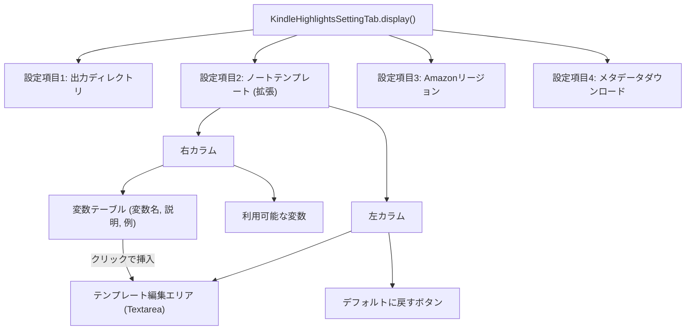

# TemplateVariablesModal 機能統合計画

## 1. 背景

`TemplateVariablesModal` として提供されているテンプレート変数一覧表示機能を、テンプレート編集画面内に直接統合し、モーダル表示を廃止する。これにより、ユーザーがテンプレート編集作業をしながら変数を容易に参照できるようにし、編集の効率性と利便性を向上させる。

## 2. 現状の確認

*   テンプレート編集機能は `src/settings.ts` 内の `TemplateEditorModal` クラスで実装されている。
*   テンプレート変数一覧表示機能は `src/settings.ts` 内の `TemplateVariablesModal` クラスで実装されている。
*   変数定義（名前、説明、例）は `TemplateVariablesModal` 内にハードコードされている。

## 3. 改修計画

### 3.1. モーダルの廃止と機能の統合

*   `TemplateEditorModal` クラスと `TemplateVariablesModal` クラスを `src/settings.ts` から削除する。
*   これらのモーダルが担っていたテンプレート編集機能（テキストエリア、リセットボタン）と変数一覧表示機能（変数テーブル）を、`KindleHighlightsSettingTab` クラスの `display` メソッド内に直接実装する。
*   `KindleHighlightsSettingTab` 内の「Note Template」設定項目のUIを大幅に変更する。

### 3.2. 新しいUIレイアウト

*   「Note Template」設定項目内に、左右2カラムのレイアウトを設けることを基本方針とする。
    *   **左カラム:** テンプレート編集用の大きなテキストエリアと、その下に「Reset to Default」ボタンを配置する。
    *   **右カラム:** テンプレート変数の一覧をテーブル形式で常時表示する。各行には「変数名」「説明」「使用例」を表示する。
*   **代替レイアウト:** 設定画面の幅の制約により左右2カラムの表示が著しく見づらくなる場合は、変数一覧を編集エリアの上部に配置する案を検討する。
*   CSSによる表示幅の調整は、Obsidianの標準的な設定タブの制約内で可能な範囲で試みる。

### 3.3. 変数挿入機能

*   右カラム（または上部）の変数一覧テーブルの各変数名（または専用の挿入ボタン）をクリックすると、対応する変数文字列（例: `{{ title }}`）が左カラム（または下部）のテンプレート編集テキストエリアの現在のカーソル位置に挿入される機能を実装する。
*   ドラッグ＆ドロップによる挿入は、初期実装ではスコープ外とする。

### 3.4. 既存コードの整理

*   `KindleHighlightsSettingTab` 内の `showTemplateEditorModal()` および `showTemplateVariablesModal()` メソッドと、それらを呼び出していたボタンを削除する。
*   `TemplateVariablesModal` 内で定義されていた変数情報（名前、説明、例）は、`KindleHighlightsSettingTab` 内の新しいUI構築ロジックに移植する。

## 4. Mermaid図 (変更後のUI構成イメージ - 左右2カラムの場合)

## 5. 主な変更対象ファイル

*   `src/settings.ts`: `KindleHighlightsSettingTab` クラスの `display` メソッドを中心に大幅な変更。`TemplateEditorModal` と `TemplateVariablesModal` クラスは削除。

## 6. 懸念事項

*   Obsidian の設定タブの幅の制約により、左右2カラムレイアウトが見づらくなる可能性。その場合は代替レイアウト（変数一覧を上部配置）を検討する。
